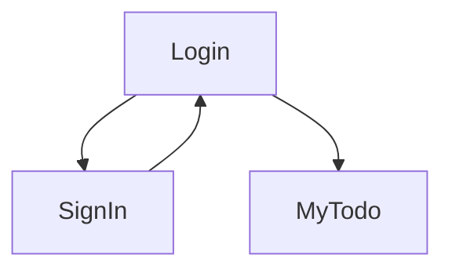

# Ebytr_Desafio_Tecnico

## Frontend Online on

https://desafio_ebytr.surge.sh

## Executando com docker-compose

É necessário possuir `docker` e `docker-compose` instalados na máquina com as permissões corretas para o usuário.

### Para iniciar o ambiente:

`cd app && docker-compose -f docker-compose.yml up -d --build`

#### Usando npm

`npm run compose:up`

### Para parar o ambiente:

`cd app && docker-compose -f docker-compose.yml down --remove-orphans`

#### Usando npm

`npm run compose:down`

## Executando com node 16 instalado no ambiente

Até o momento 05/07/22 apenas o frontend roda localmente:
`cd app/frontend && npm i && npm start`

## Fluxo da aplicação

O fluxos que estão funcionais (localmente p/ testes) são:

1. O fluxo de *sign in* e *login*.

2. Criação e exclusão de tarefas.

3. Edição de tarefas



## Dados usados

### Dados de identificação de usuário

Nome e email. É utilizada uma senha que deve retornar um token.

### Dados da tarefa

Data de criação, Título e Status. No banco de dados a tarefa deve possuir o id do dono.

## Tecnologias usadas no frontend

- React React-Router
- Redux React-Redux redux-devtools-extension
- Eslint
- NodeJS
- ShellScript
- Docker Docker-Compose

## TODO:

- [ ] Dockerização do banco de dados

- [ ] Dockerização do backend

- [x] Dockerização do frontend

- [x] Editar Tarefa

- [ ] Ordenar Tarefa pela Data de Criação 

- [ ] Ordenar Tarefa pelo Título

- [ ] Ordenar Tarefa pelo Status

- [x] Excluir Tarefa

- [x] Adicionar Tarefa

- [x] Criação do React Front Básico

- [x] Configuração do linter

- [x] Router

- [x] Redux

- [x] Login

### Pacotes instalados no Frontend

```bash
npm i -S prop-types
npm i react-router-dom@v5
npm i react-redux redux redux-thunk
npm i composewithdevtools
npm i redux-devtools-extension

```

**Requisitos técnicos:**

1. Front-End em **React**;
2. Back-End em **NodeJS**, com **MySQL**;
3. Arquitetura em **camadas**;

**Funcionalidades:**

1. Visualizar a lista de tarefas;

2. Esta lista deve ser ordenável por ordem alfabética, data de criação ou por status;

3. Inserir uma nova tarefa na lista;

4. Remover uma tarefa da lista;

5. Atualizar uma tarefa da lista;

6. A tarefa deve possuir um status editável: pendente, em andamento ou pronto;

`Critérios de avaliação`
Nosso time irá avaliar a sua entrega olhando, principalmente, para os itens abaixo:

1. Atendimento aos requisitos técnicos e funcionais;
2. Seu projeto deve rodar sem erros;
3. Entendimento dos conceitos das camadas adotadas;
4. Código e componentes reutilizados;
5. Habilidade em escrever testes (mínimo 30% de cobertura);
6. Boa legibilidade do código;
7. Separação do front e backend;
8. Mensagens de commits bem descritas e commits com um escopo nítido;
9. Referências de códigos de terceiros;
10. Instruções nítidas no README do projeto para setup e execução da aplicação e dos testes.

`Dicas importantes!`

1. Ter uma boa cobertura de testes Front e Back;

2. Aplicar boas práticas de escrita de código;

3. Documentação do projeto (README), que inclua:

4. Passo a passo para instalar e executar o projeto. Incluindo instruções especiais para instalar dependências e/ou bancos de dados, se houver;

5. Endereço da aplicação no **Heroku**, se houver (ou outro serviço de *deployment*);

6. Ter um **linter** configurado;

7. O projeto deverá ser entregue via repositório pessoal no GitHub (utilize boas práticas de criação/nomeação de *branches*, além de mensagens de *commits* bem descritas e *commits* com um escopo nítido).

# config do eslint

frontend:

```sh
npm -i -D
./node_modules/.bin/eslint --init
npm i -D eslint-config-trybe-frontend

```
